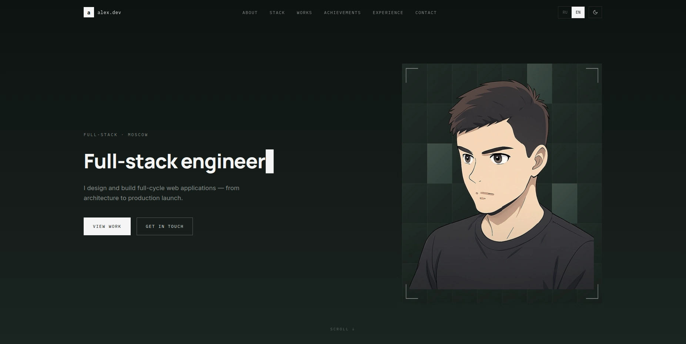

# IIyCbKA Portfolio

[](LICENSE)


A responsive personal portfolio built with React and TypeScript.

The website presents my projects, technical stack, achievements and professional experience in a restrained editorial style.

---

## ✨ Features

- 🌗 Dark, light and system themes
- 🌍 English & Russian localization
- 📱 Responsive layout for desktop, tablet and mobile devices
- ⚡ Built with React + TypeScript + Vite
- 🎨 Custom design and animations
- 🚀 Automatic deployment with GitHub Actions

---

## 📸 Preview



Live Demo: https://IIyCbKA.github.io/

---

## 📚 Sections

- 👤 About
- 🛠️ Stack
- 🚀 Works
- 🏆 Achievements
- 💼 Experience
- 🤝 Contact

---

## 🛠 Tech Stack

- React
- TypeScript
- Vite
- Sass
- Zustand
- SVGR

---

## 🚀 Getting Started

Clone the repository:
```bash
git clone https://github.com/IIyCbKA/IIyCbKA.github.io.git
cd IIyCbKA.github.io
```

Install dependencies:
```bash
npm install
```

Start the development server:
```bash
npm run dev
```

Create a production build:
```bash
npm run build
```

Preview the production build locally:
```bash
npm run preview
```

---

## 💬 Feedback

Suggestions and issue reports are welcome. 
You can open an issue or submit a pull request with a proposed improvement.

---

## 📄 License

The source code is available under the MIT License.

Personal information, written content, branding, screenshots and project images are not covered by the MIT License unless explicitly stated otherwise.

© 2026 IIyCbKA
